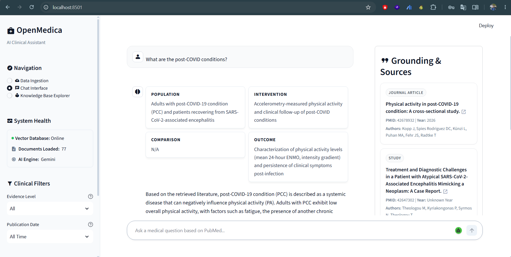
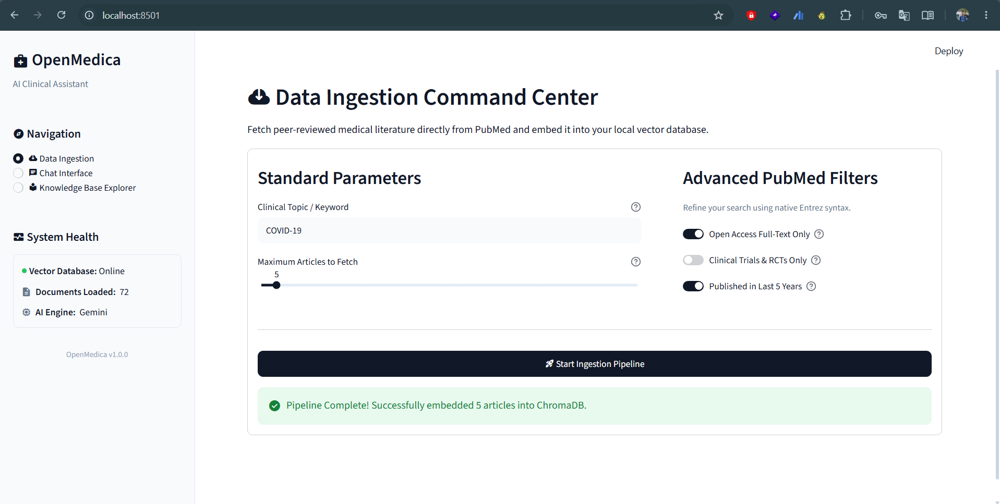
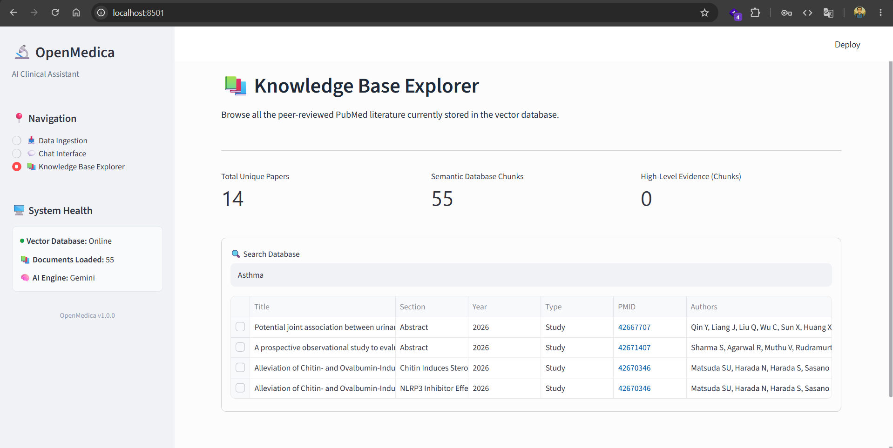

<div align="center">
  
# 🩺 OpenMedica

[](https://www.python.org/)
[](https://fastapi.tiangolo.com/)
[](https://streamlit.io/)
[](https://www.docker.com/)
[](https://opensource.org/licenses/MIT)

**A zero-hallucination Medical RAG pipeline strictly grounded in peer-reviewed PubMed literature.**

<br>
  


</div>

---

## 📸 Application Showcase

### 1. Data Ingestion Command Center
An advanced UI query builder that connects directly to the PubMed API. Easily fetch and index clinical abstracts and full-text PMCs directly into the local ChromaDB vector store with smart boolean filtering.



### 2. Knowledge Base Explorer
A live, searchable data grid showing exactly what literature is currently embedded in your vector database, including publication years, evidence types, and interactive PMC abstracts.



### 3. Clinical Chat Interface (PICO-Formatted RAG)
The core multi-agent chat interface. The AI strictly extracts Population, Intervention, Comparison, and Outcome (PICO) data from retrieved PubMed literature. Verified citations with evidence-level badges (e.g., RCT, Meta-Analysis) are rendered dynamically in the sidebar.


---

## 📖 Table of Contents
- [Overview](#-overview)
- [Key Features](#-key-features)
- [Architecture & Tech Stack](#-architecture--tech-stack)
- [Getting Started](#-getting-started)
  - [Prerequisites](#prerequisites)
  - [Docker Deployment (Quickstart)](#docker-deployment-quickstart)
  - [Local Development](#local-development)
- [Project Structure](#-project-structure)
- [Usage Guide](#-usage-guide)
- [Contributing](#-contributing)
- [License & Acknowledgments](#-license--acknowledgments)

---

## 🌟 Overview

**OpenMedica** is an open-source clinical AI assistant designed to solve the critical issue of hallucinations in modern LLMs. Built with an OpenEvidence-style architecture, it combines the vast, peer-reviewed database of PubMed with a strict, Multi-Agent RAG pipeline (powered by Pydantic AI). 

Every clinical answer is factual, traceable, graded by evidence quality, and strictly grounded in real medical science.

## ✨ Key Features

- **Zero Hallucination Guarantee:** Enforced through strict output schemas and a Multi-Agent Verification Pipeline (Synthesizer & Reviewer).
- **Clinical Evidence UI:** OpenEvidence-style evidence grading (RCTs, Meta-Analyses) and forced **PICO** (Population, Intervention, Comparison, Outcome) formatting.
- **Advanced Hybrid Search:** Combines semantic ChromaDB Vector search with exact BM25 keyword matching and MeSH term query expansion.
- **Data Command Center:** An advanced UI Query Builder for live PMC full-text ingestion, chunking, and metadata filtering.
- **Sidebar Cockpit:** A system health dashboard allowing live, visual tuning of RAG retrieval depth.
- **Decoupled Architecture:** A robust FastAPI backend communicating seamlessly with a rapid Streamlit frontend.

## 🏗️ Architecture & Tech Stack

<!-- Placeholder for an Architecture Diagram -->
> *Diagram Placeholder: User -> Streamlit -> FastAPI -> Pydantic AI (Multi-Agent) -> ChromaDB & PubMed API*

- **Backend:** FastAPI, Python, `uv` (for ultra-fast dependency management).
- **Frontend:** Streamlit.
- **Data Engine:** Biopython (PubMed API), ChromaDB (Vector & Metadata Storage).
- **Agent Framework:** Pydantic AI.
- **AI Models:** Model-agnostic design (Defaults to Gemini 1.5 Flash/Pro and Gemini Embeddings via Google AI Studio).

---

## 🚀 Getting Started

### Prerequisites
Before you begin, ensure you have the following installed:
- [Docker & Docker Compose](https://www.docker.com/) (Recommended)
- Git
- [uv](https://github.com/astral-sh/uv) (If developing locally without Docker)

### 1. Environment Setup
To run this project locally, you must first configure your API keys and environment variables:

```bash
# Clone the repository
git clone https://github.com/shuvomonowar00/OpenMedica.git
cd OpenMedica

# Copy the template environment file
cp .env.example .env
```
Open the newly created `.env` file and replace the placeholder values (e.g., `your_gemini_api_key_here`) with your actual API keys and preferred LLM models.

### 2. Docker Deployment (Quickstart)
The easiest way to run OpenMedica is via our pre-configured Docker containers.

```bash
docker-compose build
docker-compose up
```
- **Frontend UI:** `http://localhost:8501`
- **Backend API Docs (Swagger):** `http://localhost:8000/docs`

### 3. Local Development (Advanced)
If you wish to develop locally and utilize the strict `pyproject.toml` environments:

**Terminal 1 (Backend):**
```bash
cd backend
uv sync
uv run uvicorn main:app --reload --port 8000
```

**Terminal 2 (Frontend):**
```bash
cd frontend
uv sync
uv run streamlit run app.py --server.port 8501
```

---

## 📂 Project Structure

```text
OpenMedica/
├── backend/          # FastAPI server, PubMed fetcher, and Pydantic AI RAG engine
├── frontend/         # Streamlit user interface, Sidebar Cockpit, Query Builder
├── tests/            # Independent testing suites for frontend & backend
├── doc/              # Project documentation and architectural guidelines
└── docker-compose.yml# Container orchestration
```

---

## 💡 Usage Guide

1. **Ingestion:** Navigate to the main tabs to access the Advanced Query Builder. Define your search parameters, apply MeSH expansion, and pull live abstracts/full-text into the ChromaDB vector store.
2. **Tuning:** Open the **Sidebar Cockpit** to monitor system health and adjust the RAG retrieval depth slider based on your query complexity.
3. **Chatting:** Ask clinical questions in the main interface. The Multi-Agent system will parse the query, retrieve grounded evidence, and output a strict PICO-formatted response complete with evidence quality badges.

---

## 🤝 Contributing

Contributions are what make the open-source community such an amazing place to learn, inspire, and create. Any contributions you make are **greatly appreciated**.

1. Fork the Project
2. Create your Feature Branch (`git checkout -b feature/AmazingFeature`)
3. Commit your Changes (`git commit -m 'Add some AmazingFeature'`)
4. Push to the Branch (`git push origin feature/AmazingFeature`)
5. Open a Pull Request

---

## 📜 License & Acknowledgments

- Distributed under the **MIT License**.
- Medical abstract data is provided courtesy of the **National Center for Biotechnology Information (NCBI)** / **PubMed** API.
