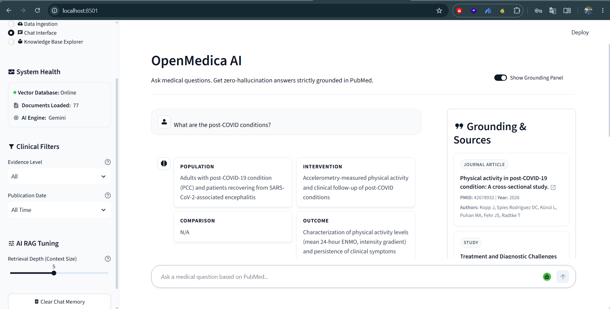
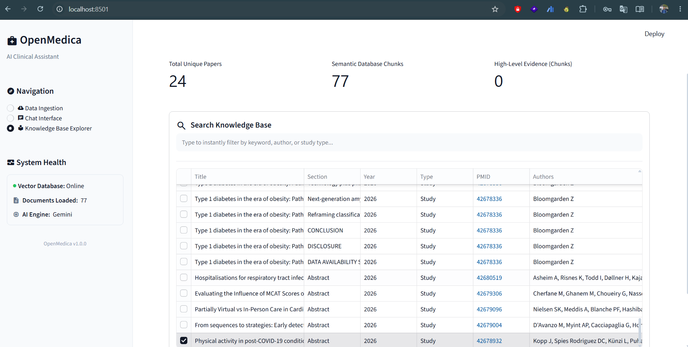
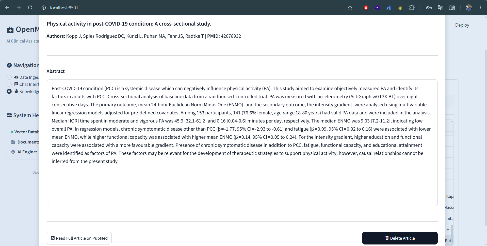
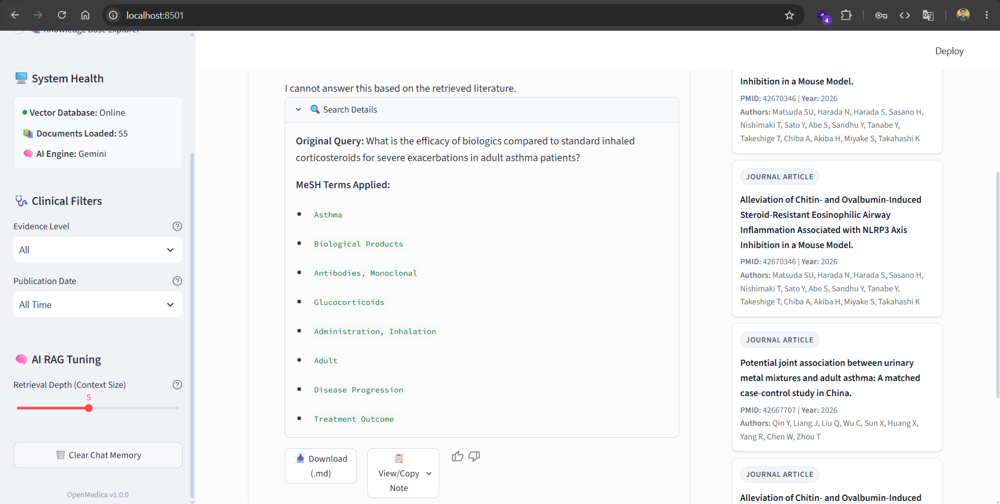

<div align="center">
  
# 🩺 OpenMedica

[](https://www.python.org/)
[](https://fastapi.tiangolo.com/)
[](https://streamlit.io/)
[](https://www.docker.com/)
[](https://opensource.org/licenses/MIT)

**A Medical RAG pipeline grounded in peer-reviewed PubMed literature.**

<br>
  


</div>

---

## 📸 Application Showcase

### 1. Data Ingestion Command Center
A UI query builder that connects to the PubMed API. Fetch and index clinical abstracts and full-text PMCs directly into the local ChromaDB vector store using boolean filtering.


### 2. Knowledge Base Explorer
A searchable data grid displaying the literature currently embedded in the vector database, including publication years, evidence types, and interactive PMC abstracts.


<br>


### 3. Clinical Chat Interface (PICO-Formatted RAG)
The core multi-agent chat interface. The AI extracts Population, Intervention, Comparison, and Outcome (PICO) data from retrieved PubMed literature. Verified citations with evidence-level badges are rendered dynamically.


<br>


---

## 📖 Table of Contents
- [Overview](#-overview)
- [Key Features](#-key-features)
- [Architecture & Tech Stack](#-architecture--tech-stack)
- [Getting Started](#-getting-started)
  - [Prerequisites](#prerequisites)
  - [Docker Deployment](#docker-deployment)
  - [Local Development](#local-development)
- [Project Structure](#-project-structure)
- [Usage Guide](#-usage-guide)
- [Contributing](#-contributing)
- [License & Acknowledgments](#-license--acknowledgments)

---

## 🌟 Overview

**OpenMedica** is an open-source clinical AI assistant focused on mitigating hallucinations in large language models. Built using an OpenEvidence-style architecture, it integrates the PubMed database with a Multi-Agent RAG pipeline powered by Pydantic AI.

Clinical responses are designed to be traceable, graded by evidence quality, and grounded in peer-reviewed medical literature.

## ✨ Key Features

- **Multi-Agent Verification Pipeline:** Utilizes Synthesizer and Reviewer agents alongside strict output schemas to improve response accuracy.
- **Clinical Evidence UI:** Implements OpenEvidence-style grading (e.g., RCTs, Meta-Analyses) and enforces PICO (Population, Intervention, Comparison, Outcome) formatting.
- **Hybrid Search Capabilities:** Integrates ChromaDB semantic search with BM25 keyword matching and MeSH term query expansion.
- **Data Ingestion Interface:** Features a UI query builder for PMC full-text ingestion, chunking, and metadata filtering.
- **System Dashboard:** Includes a sidebar interface for monitoring system health and configuring RAG retrieval depth.
- **Decoupled Architecture:** Built with a FastAPI backend and a Streamlit frontend.

## 🏗️ Architecture & Tech Stack

<!-- Placeholder for an Architecture Diagram -->
> *Diagram Placeholder: User -> Streamlit -> FastAPI -> Pydantic AI (Multi-Agent) -> ChromaDB & PubMed API*

- **Backend:** FastAPI, Python, `uv` for dependency management.
- **Frontend:** Streamlit.
- **Data Engine:** Biopython (PubMed API), ChromaDB.
- **Agent Framework:** Pydantic AI.
- **AI Models:** Model-agnostic design (Supports Gemini, OpenAI, and Anthropic).

---

## 🚀 Getting Started

### Prerequisites
Ensure the following dependencies are installed:
- [Docker & Docker Compose](https://www.docker.com/) (Recommended)
- Git
- [uv](https://github.com/astral-sh/uv) (If developing locally)

### 1. Environment Setup
Configure your API keys and environment variables prior to running the application:

```bash
# Clone the repository
git clone https://github.com/shuvomonowar00/OpenMedica.git
cd OpenMedica

# Copy the template environment file
cp .env.example .env
```
Open the `.env` file to configure your keys. 

**Model Agnostic Configuration:**
OpenMedica supports dynamic provider switching via a factory pattern. Configure the active LLM provider through environment variables without modifying source code.

```env
ACTIVE_LLM_PROVIDER=gemini     # Supported values: gemini, openai, anthropic
GEMINI_API_KEY=your_gemini_api_key
OPENAI_API_KEY=your_openai_api_key
ANTHROPIC_API_KEY=your_anthropic_api_key
```
Supply the corresponding API key (`GEMINI_API_KEY`, `OPENAI_API_KEY`, or `ANTHROPIC_API_KEY`) for your selected provider.

### 2. Docker Deployment
Deploy OpenMedica using the provided Docker containers:

```bash
docker-compose build
docker-compose up
```
- **Frontend UI:** `http://localhost:8501`
- **Backend API Docs (Swagger):** `http://localhost:8000/docs`

### 3. Local Development
To run the application locally using `uv` environments:

**Terminal 1 (Backend):**
```bash
cd backend
uv sync
uv run uvicorn main:app --reload --port 8000
```

**Terminal 2 (Frontend):**
```bash
cd frontend
uv sync
uv run streamlit run app.py --server.port 8501
```

---

## 📂 Project Structure

```text
OpenMedica/
├── backend/          # FastAPI server, PubMed fetcher, and Pydantic AI RAG engine
├── frontend/         # Streamlit user interface, Sidebar Cockpit, Query Builder
├── tests/            # Independent testing suites for frontend & backend
├── doc/              # Project documentation and architectural guidelines
└── docker-compose.yml# Container orchestration
```

---

## 💡 Usage Guide

1. **Ingestion:** Navigate to the main tabs to access the query builder. Define search parameters, apply MeSH expansion, and pull abstracts or full-text into the ChromaDB vector store.
2. **Tuning:** Open the sidebar cockpit to monitor system health and adjust the RAG retrieval depth based on query requirements.
3. **Chat Interface:** Submit clinical questions in the main interface. The Multi-Agent system parses the query, retrieves evidence, and outputs a PICO-formatted response with corresponding citations.

---

## 🤝 Contributing

Contributions are highly encouraged. To contribute:

1. Fork the Project
2. Create your Feature Branch (`git checkout -b feature/AmazingFeature`)
3. Commit your Changes (`git commit -m 'Add some AmazingFeature'`)
4. Push to the Branch (`git push origin feature/AmazingFeature`)
5. Open a Pull Request

---

## 📜 License & Acknowledgments

- Distributed under the **MIT License**.
- Medical abstract data is provided by the **National Center for Biotechnology Information (NCBI)** / **PubMed** API.
